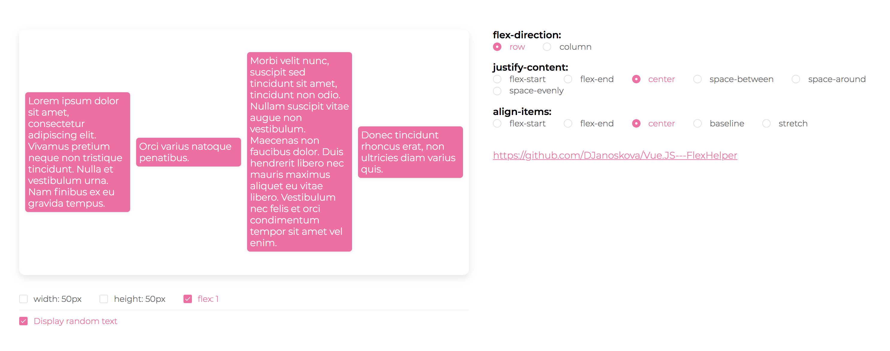

# flex-helper



Check the demo at <a href="https://flex-helper.danajanoskova.sk/">https://flex-helper.danajanoskova.sk/</a>

## Project setup
```
npm install
```

### Compiles and hot-reloads for development
```
npm run serve
```

### Compiles and minifies for production
```
npm run build
```

### Run your tests
```
npm run test
```

### Lints and fixes files
```
npm run lint
```

### Customize configuration
See [Configuration Reference](https://cli.vuejs.org/config/).
